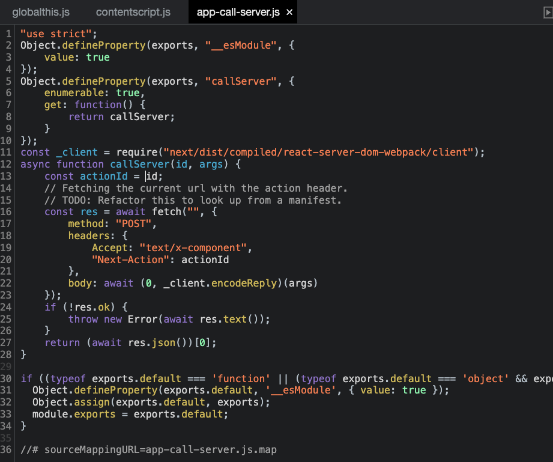

# Next.js Server Actions (aka use-server)

## Run on your machine 🚀

`pnpm i`

`pnpm dev`

---

## How this works? 🤔

1 line answer : `api-call-server` Module

detail answer :

when next.js is compiled, this module is autometically generated.

this `api-call-server` module is the key for Server Actions.

Every Server Actions use this module for Server Request

if you call the function that contains `"use server"` statement, it actually calls CallServer Function for server request. 

The Key Points is three

- Actions Id
    - Every Server Actions has unique id. it can be used for routing on server-side

- `Next-Actions` field in Header
    - This field contains Actions Id. Server check this and identifies the type of action

- fetch body : your function arguments will be here

This is 100% autometically generated. So you don't need to do anything