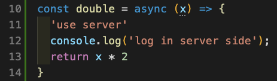
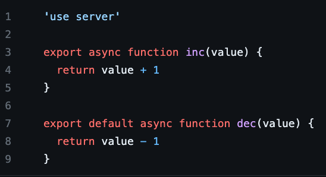

# Next.js Server Actions (aka use-server) Explained

this code is originally written by [shuding](https://github.com/shuding). you can check original source code [here](https://github.com/vercel/next.js/tree/ee48c667313524f5effeb0e32af1acc78299e849/test/e2e/app-dir/actions)

---

## Run on your machine 🚀

`pnpm i`

`pnpm dev`

---

## How this works? 🤔

1 line answer : `api-call-server.js` Module

detail answer :

when next.js is compiled, `api-call-server.js` is autometically generated.

this `api-call-server` module is the key for Server Actions.

Every Server Actions use this module for Server Request

if you call the function that contains `"use server"` statement, it actually calls `CallServer Function` in `api-call-server.js` for server request. 

### The Key Points is three

- Actions Id
    - Every Server Actions(use-server functions) have unique id. it can be used for routing on server-side

- `Next Actions` field in Header
    - This field contains Actions Id. Server check this and identifies the type of action

- fetch body : your function arguments will be here

This is 100% autometically generated. So you don't need to do anything

---

## How Can I Use This?

- I tested this using next.js `13.3.2-canary.14` version. so if you want to test `Next Actions`, this version is recommanded.
- You must use `App Routing`, not Page routing
- in App directory, write some function. we call it `Server Action`
- `Server Action` must be async function. returning promise is not enough. if it is not async function, it throws compile error.
- add `"use server"` statement in the first line of `Server actions`.
- 🎉 congraturations ! this function will be sort of API Endpoint. for example

- or make ts file. and add the `"use server"` statement on the first line. then this module will be collection of API Endpoint. 

for example 

in this example, `inc` and `dec` functions are API Endpoint.you don't need any configuration for routing  at all.

you can use this functions on another server-components module